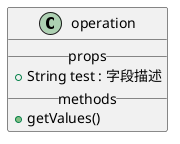

# plantumlToVue
## 描述
将plantuml的特定的class代码转换为vue组件代码
例如

转换为
```vue
<template></template>
import { defineComponent } from '@vue/composition-api';
export default defineComponent({
    name: 'operation',
    props: { 
        // 字段描述
        test : {
            type: String,
            default: undefined,
        }, 
    },
    setup(){
        function getValues (){


        };
        return {
            getValues,

        }
    }
});
```